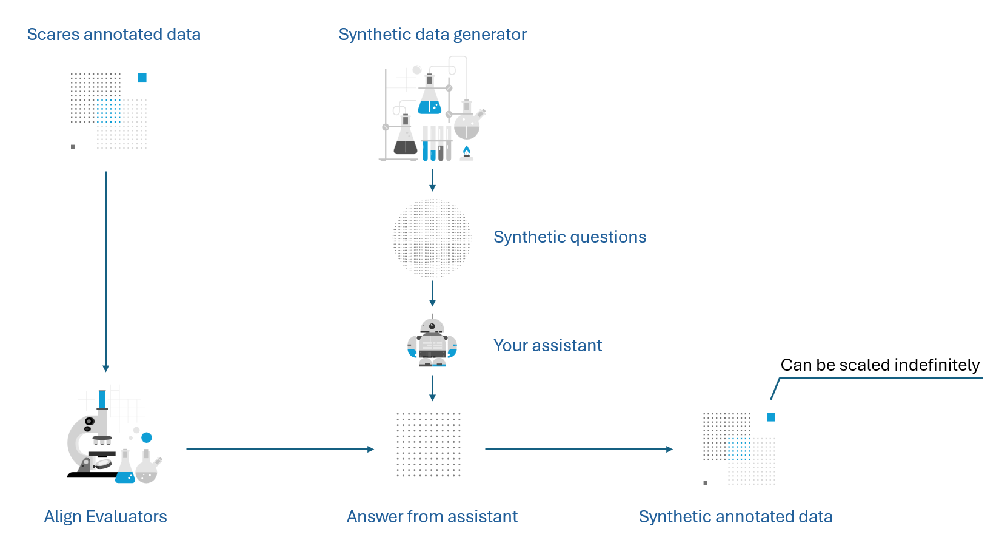
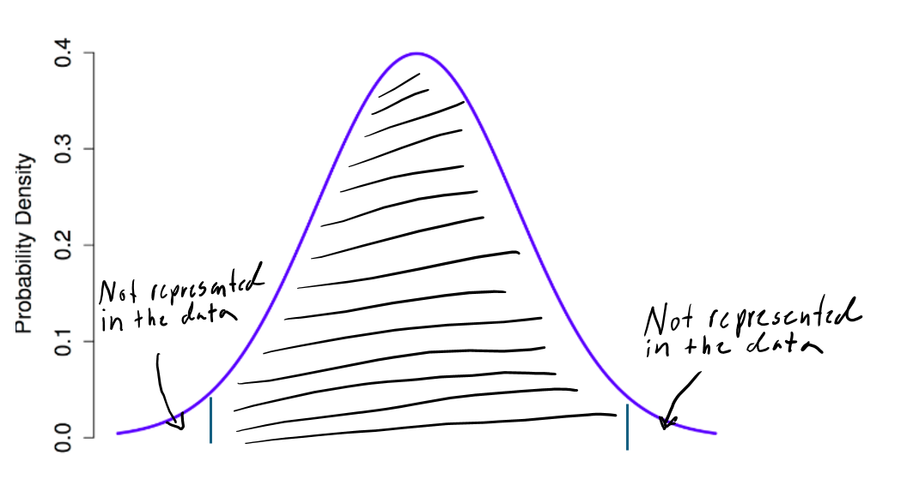
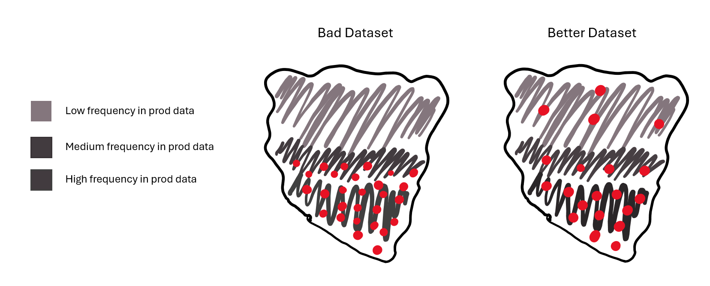

# Note
This branch is tailored to perform recall tests for Azure AI Search. The documentation in the repository is not correct. The docstrings in the code are also incorrect and outdated. Please follow the notebook "run_recall.ipynb". The notebook does three things:

1. Collects chunks from your index.
2. Generates synthetic questions. The generated questions are designed to be related to a specific chunk.
3. Tests if the correct chunk is retrieved when the synthetic questions are queried. 

To be able to run the test, you will need to install the Python dependencies in the requirements.txt file and add your secrets to the env_example file. You also need to rename the env_example file to .env.


# AI Assistant Alignment and Evaluation:

Welcome to the AI Assistant Alignment and Evaluation project! This repository is designed to accelerate your evaluation and alignment efforts for AI Assistants. It includes best practices and a user-friendly framework that you can tailor to your specific needs. **This methodology has been successfully used to align AI Assistants deployed to millions of consumers.** Please note that the content in this repository is entirely fictional.

Note: This repository is designed to be 'bring your own assistant'. The methodology provided here serves as a wrapper around your existing assistant implementation.

If you have any questions, encounter issues, or need assistance with setting up the repository, please don't hesitate to contact us.

## Table of Contents

- [Solution Overview](#solution-overview)
- [Key Technology Cloud Technologies](#key-technology-cloud-technologies)
- [Importance of Synthetic Data in AI Alignment](#importance-of-synthetic-data-in-ai-alignment)
    - [Importance of Sufficient Data Quantity](#importance-of-sufficient-data-quantity)
    - [Out of Distribution Behaviour](#out-of-distribution-behaviour)
- [Importance of Automatic Evaluators](#importance-of-automatic-evaluators)
    - [Iterative Alignment](#iterative-alignment)
    - [Scale the Evaluation](#scale-the-evaluation)
- [Get Started](#get-started)

## Example Content

The prefilled content is entirely fictional and represents a fictional Swedish bank aiming to launch AI Assistants for its customers. Given the Swedish regulations regarding financial marketing, the bank needs to align and evaluate the assistant's behavior to ensure compliance with the laws.

## Solution Overview

The methodology is built on two crucial pillars: **synthetic data generation** and **automatic evaluators**. Our field experience indicates that both synthetic data and automatic evaluators are often overlooked and underutilized. This is primarily due to a lack of understanding of the underlying mathematical properties of generative AI models and the challenges associated with effectively implementing these components. This repository aims to accelerate and empower developers to harness the potential of these components by compiling key learnings from our work with companies that have launched AI solutions to millions of users.



## Key Technologies

- **Azure OpenAI**: Leverages advanced models for chat, embeddings, and evaluation. (Can be substituted with OpenAI or Azure MaaS)
- **Azure AI Evaluation SDK**: Provides a robust framework for evaluation orchestration, capable of running both locally and at scale in the cloud.
- **Prompty**: Enhances rapid ideation and efficient prompt management.

## Importance of Synthetic Data in AI Alignment

Our field experience shows that synthetic data plays a crucial role in successfully aligning AI systems. Despite its importance, synthetic data is rarely used for AI evaluation and alignment. This underutilization is often due to a lack of understanding of its benefits and the challenges associated with its implementation.

### Importance of Sufficient Data Quantity

Having a sufficient quantity of data from a representative distribution is crucial for the effective alignment and evaluation of AI systems. Current AI models are unpredictable and sensitive to small changes in prompts. To align and evaluate reliably, it is important to sample extensively from the distribution of possible questions to be able make statistically significant conclusions. Additionally, many AI systems may have an asymmetric risk profile, meaning that misalignment can lead to significant consequences. For such solutions, it is crucial to scale the annotated data to achieve statistically significant results with an acceptable risk profile.

### Out of Distribution Behaviour
A common pattern we have observed is that the sampled questions used for alignment and evaluation do not represent the entire distribution of questions that will be asked to the AI assistant. Often, the dataset exclusively contains the most common topics, lengths, and phrasings. The image below illustrates the sampling cut-off from the tails of the distribution. (Please note that the image is purely illustrative and not representative of a real distribution.)



The behavior of AI systems for questions that fall outside the sampling distribution used for alignment and evaluation often results in unpredictable outcomes. Therefore, it is crucial to obtain samples from as large a portion of the distribution as possible. Synthetic data is an excellent tool for achieving a dataset that covers a broader range of possible questions, as it can be scaled indefinitely and eliminates human biases.



## Importance of Automatic Evaluators

### Iterative Alignment 

To rapidly iterate on prompts, configurations, or fine-tuned models, it is crucial to have a swift evaluation method to determine if the system has improved. Automatic evaluators can provide near-instant feedback, eliminating the need to rely on human domain experts for daily development tasks. 

### Scale the Evaluation

To effectively cover a significant dataset, it is important to scale the evaluations. Scaling evaluations to a sufficient number of data points often requires automated evaluators that can either operate independently or assist in reducing the number of data points that need to be reviewed by a human.

## Get Started

To get started with the AI Assistant Alignment and Evaluation project, follow these steps:

### Prerequisites

- [Git](https://git-scm.com/)
- Azure OpenAI with deployed chat and embedding model
- [Anaconda](https://www.anaconda.com/products/distribution) or [Miniconda](https://docs.conda.io/en/latest/miniconda.html) (optional)
- Prompty extention to vscode (optional)

### Step 1: Fork the repository

Log in to GitHub with your GitHub account. Fork this repo by selecting the Fork menu in the GitHub top right corner.


### Step 1: Clone the Repository

Open your terminal and clone the repository using the following command:

```sh
git clone https://github.com/albinlonnfalt/AI-Assistant-Alignment-and-Evaluation.git
cd AI-Assistant-Alignment-and-Evaluation
```

### Step 2: Create a Conda Environment

Create a new conda environment with python 3.11:

```sh
conda create --name ai-assistant-alignment-and-evaluation python=3.11
```

Activate the newly created environment:

```sh
conda activate ai-assistant-alignment-and-evaluation
```

### Step 3: Install Requirements

Install the required Python packages using the `requirements.txt` file:

```sh
pip install -r requirements.txt
```
### Step 4: Select Interpreter for Python

Press `Ctrl + Shift + P`, type `Python: Select Interpreter`, and choose the environment you just created.

### Step 5: Set Up .env File

Open the `env_example` file and enter your credentials. Once completed, rename the file to `.env`.

### Step 6: Begin Using the Modules

Congratulations! You are now ready to dive into the modules and continue the setup process. Each module comes with its own README file to guide you through the specifics. Don't worry, the exciting part starts now!

### Modules

[Synthetic Data Generator](synthetic_data_generator/README.md)

[Custom Evaluator](custom_evals/README.md)

[Run Evaluation](run_evals/README.md)
