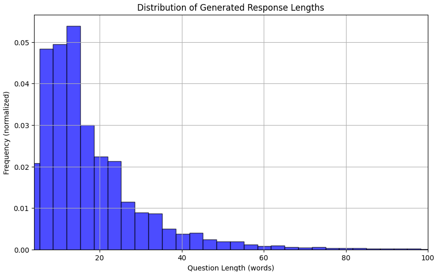

# Synthetic Data Generator

## **NOTE**
In this version predetermine config injections are removed. Instead you can specify any file with any file name in the config/injections folder. Every file will be writen and a value from the file will be injected to the data generator. This open up for more use cases. **NOTE** the limitations 1. The namn of the file will be used as a key in the prompt along with the value. This means that the namn of the file must represent the content in a way that the language model understands it. 2. The key must match the filename excluded from the file extentions. For example tone.json most contain -> [{"tone": "...", "frequency score": ..}, ..., {"tone": "...", "frequency score": ..} ].

## Table of Contents

- [Synthetic Data Generator](#synthetic-data-generator)
- [Solution Overview](#solution-overview)
- [Importance of Synthetic Data in AI Alignment](#importance-of-synthetic-data-in-ai-alignment)
    - [Significance of Sufficient Data Quantity](#significance-of-sufficient-data-quantity)
    - [Out of Distribution Behavior](#out-of-distribution-behavior)
- [Configuration and Execution](#configuration-and-execution)
    - [Configuration](#configuration)
        - [context.txt](#contexttxt)
        - [topics.json](#topicsjson)
        - [tones.json](#tonesjson)
        - [languages.json](#languagesjson)
        - [additional_instructions.json](#additional_instructionsjson)
        - [response_length_distribution.json](#response_length_distributionjson)
    - [Execution](#execution)
- [Analyzing Generated Data](#analyzing-generated-data)

## Solution Overview

The Synthetic Data Generator allows users to specify configurations such as topics, tones, and lengths of synthetic user inputs. These configurations are independently selected through a statistical draw and then inserted into the prompt. A high temperature setting is used to introduce variety in the generated data.

## Importance of Synthetic Data in AI Alignment

Synthetic data plays a crucial role in successfully aligning AI systems. Despite its importance, synthetic data is rarely used for AI evaluation and alignment due to a lack of understanding of its benefits and the challenges associated with its implementation.

### Significance of Sufficient Data Quantity

Having a sufficient quantity of data from a representative distribution is crucial for the effective alignment and evaluation of AI systems. Current AI models are unpredictable and sensitive to small changes in prompts. To align and evaluate reliably, it is important to sample extensively from the distribution of possible questions to make statistically significant conclusions. Additionally, many AI systems may have an asymmetric risk profile, meaning that misalignment can lead to significant consequences. For such solutions, it is crucial to scale the annotated data to achieve statistically significant results with an acceptable risk profile.

### Out of Distribution Behavior

A common pattern observed is that the sampled questions used for alignment and evaluation do not represent the entire distribution of questions that will be asked to the AI assistant. Often, the dataset exclusively contains the most common topics, lengths, and phrasings. The image below illustrates the sampling cut-off from the tails of the distribution. (Please note that the image is purely illustrative and not representative of a real distribution.)

The behavior of AI systems for questions that fall outside the sampling distribution used for alignment and evaluation often results in unpredictable outcomes. Therefore, it is crucial to obtain samples from as large a portion of the distribution as possible. Synthetic data is an excellent tool for achieving a dataset that covers a broader range of possible questions, as it can be scaled indefinitely and eliminates human biases.

## Configuration and Execution

### Configuration

The configuration files are located in the `config` folder.

#### context.txt

The `context.txt` file provides essential context about the AI system for which the synthetic data generator is creating data. This context can include details about the company developing the system, the intended user environment, and the guidelines the AI system should adhere to.

#### topics.json

The `topics.json` file defines the range of topics that the generated data will cover. These topics should reflect a diverse array of subjects that could be encountered in the production environment. Each topic must include a frequency score, which is normalized and used in a statistical draw to determine how often the topic appears in the prompts.

#### tones.json

The `tones.json` file specifies the variety of tones that the generated data should exhibit. Each tone is assigned a frequency score, which is normalized and used in a statistical draw to determine the likelihood of each tone appearing in the prompts.

#### languages.json

The `languages.json` file specifies the languages the generated data should include. Each language is assigned a frequency score, which is normalized and used in a statistical draw to determine the likelihood of each language appearing in the prompts.

#### additional_instructions.json

The `additional_instructions.json` file contains supplementary instructions that will be incorporated into the prompts. These instructions can be highly customizable, allowing for significant improvements in the quality of synthetic data. Each instruction is assigned a frequency score, which is normalized and used in a statistical draw to determine how often each instruction appears in the prompts. Be creative with these instructions to maximize the potential of your synthetic data.

#### response_length_distribution.json

The `response_length_distribution.json` file defines the parameters for the distribution used to sample the response lengths in words. This configuration ensures that the generated user inputs have the specified lengths, which are then incorporated into the prompts.

The distribution is a shifted log-normal distribution. Here is an explanation of the parameters:
- **mean**: The mean of the underlying normal distribution.
- **sigma**: The standard deviation of the underlying normal distribution.
- **shift**: A value added to the generated length to ensure a minimum length.

Below is a plot of the distrubution with mean = 2.5, sigma = 0.75 and shift = 2

### Execution

It is recommended to run the script from the debugger. A launch file has been provided with default launch configurations named 'Generate Synthetic Data'.

## Analyzing Generated Data

In the notebook `analyse_generated_data.ipynb`, you can analyze the generated data to find overrepresented tokens, and examine the distribution and variety in the data. Detailed descriptions of the methods are provided in the notebook. **Analyzing the synthetic data and iteratively modifying the configurations to improve the quality of the synthetic data is crucial for good alignment and evaluation results.**